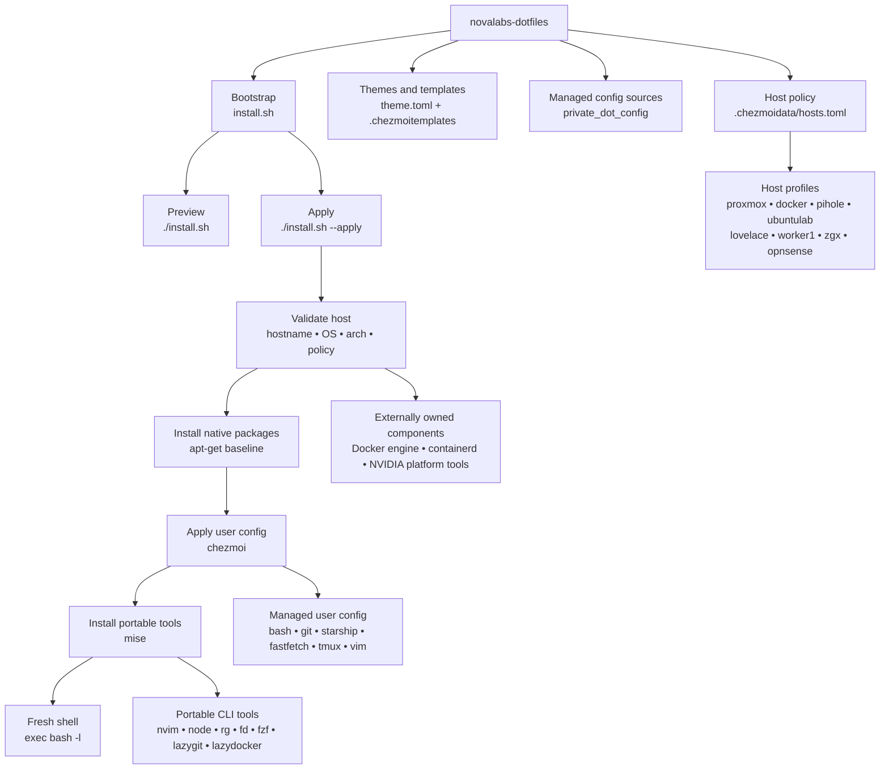

# NovaLabs Dotfiles

ChezMoi + Mise managed configuration for NovaLabs hosts.

- **Authoritative repository:** Forgejo
- **GitHub:** public mirror
- **Configuration owner:** ChezMoi
- **Portable CLI owner:** Mise
- **System/package owner:** native OS or platform vendor

The repository is designed around a simple rule: **manage user configuration centrally without taking ownership of platform components that are already managed correctly by the operating system or vendor.**

## Architecture

NovaLabs Dotfiles separates ownership into three layers.

| Layer | Owner | Examples |
|---|---|---|
| User configuration | ChezMoi | Bash, Git include, Starship, Fastfetch, btop theme, tmux, Vim, LazyGit, LazyDocker |
| Portable userland tools | Mise | Neovim, ripgrep, fd, fzf, Node, Starship, LazyGit, LazyDocker |
| System/platform components | OS or vendor | OpenSSH, Docker engine, containerd, NVIDIA platform packages |

Host policy is declared in `.chezmoidata/hosts.toml`.

## System map



### Ownership vocabulary

| Value | Meaning |
|---|---|
| `managed` | NovaLabs owns and converges the component. |
| `external` | The host or platform owns it. NovaLabs may require and validate it, but does not install, upgrade, remove, or reconfigure it. |
| `skip` | The component is outside this profile. |
| `optional` | The component is enabled only when the host enrollment selects it. |
| `optional-external` | Optional component that must already exist when enabled. |
| `stage-only` | The profile exists for representation and validation, but the generic bootstrap must not mutate the host. |

## Host profiles

| Profile | Host identity | Platform | Runtime policy | Status |
|---|---|---|---|---|
| `proxmox` | `nova` | Debian AMD64 | no Docker | migrated |
| `docker` | `docker` | Debian/Ubuntu AMD64 | Docker external; LazyDocker managed | migrated |
| `pihole` | `pihole`, `pihole2` | Debian/Raspbian AMD64 | no Docker | migrated |
| `ubuntulab` | `ubuntulab`, `ubuntu-proxmox` | Ubuntu AMD64 | optional external Docker | migrated |
| `lovelace` | `lovelace` | Debian ARM64 | containerd | migrated |
| `worker1` | `k8s-worker-01` | Debian AMD64 | containerd | migrated |
| `zgx` | `zgx`, `zgx-40e6` | Ubuntu ARM64 | NVIDIA-managed Docker; GPU btop preserved | migrated |
| `opnsense` | `opnsense`, `opnsense2` | FreeBSD AMD64 | stage-only | pending FreeBSD validation |

## Repository layout

```text
.
├── .chezmoi.toml.tmpl
├── .chezmoidata/
│   ├── hosts.toml
│   └── theme.toml
├── .chezmoiignore.tmpl
├── .chezmoiscripts/
├── .chezmoitemplates/
│   ├── fastfetch/
│   └── starship/
├── docs/
│   └── migration-ledger.md
├── private_dot_config/
├── modify_dot_bashrc
├── modify_dot_gitconfig
├── dot_tmux.conf
├── dot_vimrc
└── install.sh
```

Important source paths:

- `.chezmoidata/hosts.toml` — host identity, platform, mutation and runtime policy
- `.chezmoidata/theme.toml` — host palette data
- `private_dot_config/mise/config.toml.tmpl` — exact portable tool pins
- `.chezmoiignore.tmpl` — profile-dependent configuration inclusion
- `.chezmoitemplates/starship/` — per-profile Starship templates
- `.chezmoitemplates/fastfetch/` — per-profile Fastfetch templates
- `private_dot_config/btop/themes/novalab.theme.tmpl` — host-colored btop theme
- `install.sh` — preview-first bootstrap and native package convergence

## Bootstrap a new Linux host

Clone the repository. Hosts without Forgejo SSH access may use the public GitHub mirror.

```bash
git clone https://github.com/calico88x/novalabs-dotfiles.git ~/novalabs-dotfiles
cd ~/novalabs-dotfiles
```

Preview the bootstrap first:

```bash
./install.sh
```

The preview shows the platform, pinned bootstrap versions and native package set. It makes no changes.

Apply only after the preview is understood:

```bash
./install.sh --apply
```

During first enrollment, ChezMoi prompts for the host profile. UbuntuLab also asks whether optional Docker tooling is enabled.

After a successful initial apply:

```bash
exec bash -l
```

The active profile is available as:

```bash
echo "$NOVALAB_HOST_PROFILE"
```

### High-scrutiny enrollment

For a new, unusual, or production-sensitive host, initialize ChezMoi manually and inspect the rendered state before allowing the bootstrap to mutate the system. This is the workflow used to migrate the existing NovaLabs fleet.

Install the pinned Mise bootstrap:

```bash
curl -fsSL https://mise.run |
  MISE_VERSION=v2026.8.5 \
  MISE_INSTALL_PATH="$HOME/.local/bin/mise" \
  sh
```

Initialize ChezMoi from the cloned repository:

```bash
~/.local/bin/mise x aqua:twpayne/chezmoi@2.72.1 -- \
  chezmoi -S "$HOME/novalabs-dotfiles" init
```

ChezMoi prompts for the host profile during first initialization. UbuntuLab also prompts for optional Docker tooling.

Confirm the saved enrollment data:

```bash
cat ~/.config/chezmoi/chezmoi.toml
```

Inspect the rendered desired state:

```bash
~/.local/bin/mise x aqua:twpayne/chezmoi@2.72.1 -- \
  chezmoi diff
```

Run the host validator explicitly:

```bash
~/.local/bin/mise x aqua:twpayne/chezmoi@2.72.1 -- \
  chezmoi -S "$HOME/novalabs-dotfiles" execute-template \
  < "$HOME/novalabs-dotfiles/.chezmoiscripts/run_before_10-validate-host.sh.tmpl" |
  sh
```

Dry-run the apply:

```bash
~/.local/bin/mise x aqua:twpayne/chezmoi@2.72.1 -- \
  chezmoi apply --dry-run --verbose
```

For profiles that depend on an externally owned Docker runtime, verify it before applying:

```bash
docker info >/dev/null &&
  echo "Docker runtime: PASS"
```

Once the rendered state, validator and dry-run are correct:

```bash
./install.sh --apply
exec bash -l
```

The bootstrap runs host validation before any `sudo`, native package installation, or ChezMoi apply.

## Update an existing host

Use this workflow after a repository change:

```bash
cd ~/novalabs-dotfiles
git pull --ff-only

# Preview native/bootstrap behavior.
./install.sh

# Review user configuration changes.
chezmoi diff

# Verify the apply path without changing files.
chezmoi apply --dry-run --verbose
```

If the diff and dry-run are correct:

```bash
./install.sh --apply
exec bash -l
```

For changes that affect package ownership, host policy, templates or bootstrap behavior, update **one representative host first** before rolling the change across the fleet.

`chezmoi diff` may still show eligible `.chezmoiscripts` entries after file state has converged. Review file/config differences separately from run-script eligibility.

## Add a portable tool

Before adding anything, decide who should own it.

```text
OS/service dependency?
    -> native OS package layer

Existing vendor/platform component?
    -> external; validate but do not take ownership

Portable userland CLI?
    -> Mise

User configuration for that CLI?
    -> ChezMoi
```

### 1. Add an exact Mise pin

Edit:

```text
private_dot_config/mise/config.toml.tmpl
```

Add the tool under the existing `[tools]` table:

```toml
"aqua:vendor/tool" = "1.2.3"
```

All committed Mise versions are exact pins.

Do **not** commit floating selectors such as:

```text
latest
1
1.2
stable
release channels
```

Version upgrades should be explicit Git diffs.

### 2. Add profile conditions when required

Example:

```gotemplate
{{- if eq .profile "somehost" }}
"aqua:vendor/tool" = "1.2.3"
{{- end }}
```

Use `.chezmoiignore.tmpl` when the tool's configuration should exist only on selected profiles.

LazyDocker is the current example: it is rendered only for Docker-role hosts.

### 3. Add configuration if the tool has any

Place the source under `private_dot_config/` using ChezMoi naming semantics.

Example:

```text
private_dot_config/tool/config.toml
    -> ~/.config/tool/config.toml
```

### 4. Validate on a representative host

```bash
chezmoi cat ~/.config/mise/config.toml
chezmoi diff
chezmoi apply --dry-run --verbose
```

Then apply:

```bash
./install.sh --apply
```

Confirm the resolved binary and version:

```bash
command -v tool
tool --version
```

## Modify configuration

Edit the **repository source**, not the deployed file on each host.

Common mappings:

| Repository source | Target |
|---|---|
| `private_dot_config/bat/config` | `~/.config/bat/config` |
| `private_dot_config/lazygit/config.yml` | `~/.config/lazygit/config.yml` |
| `private_dot_config/lazydocker/config.yml` | `~/.config/lazydocker/config.yml` |
| `dot_tmux.conf` | `~/.tmux.conf` |
| `dot_vimrc` | `~/.vimrc` |

### Bash and Git are modifier-managed

NovaLabs intentionally does **not** own the entire `~/.bashrc` or `~/.gitconfig`.

- `modify_dot_bashrc` replaces only the NovaLabs managed block.
- `modify_dot_gitconfig` replaces only the shared NovaLabs Git include.
- Personal shell content and Git identity remain host-local.

Do not replace these with whole-file dotfiles unless that ownership decision is made deliberately.

### btop configuration is intentionally writable

`private_dot_config/btop/create_btop.conf` seeds `~/.config/btop/btop.conf` rather than continuously replacing a user's runtime settings.

The NovaLabs btop theme is managed separately.

On ZGX, the existing GPU-enabled `/usr/local/bin/btop` is explicitly preserved and is **not** installed through Mise.

### Host visual configuration

- Host palette data: `.chezmoidata/theme.toml`
- btop theme: rendered from host palette data
- Starship: per-profile templates under `.chezmoitemplates/starship/`
- Fastfetch: per-profile templates under `.chezmoitemplates/fastfetch/`

Starship and Fastfetch currently retain explicit per-profile templates to preserve migration parity.

### Validate a config change

On the authoring workstation:

```powershell
git diff --check
git diff
```

On a representative target host:

```bash
cd ~/novalabs-dotfiles
git pull --ff-only
chezmoi diff
chezmoi apply --dry-run --verbose
```

Then:

```bash
./install.sh --apply
```

After changing shell, prompt, PATH or tool configuration, start a fresh login shell:

```bash
exec bash -l
```

## Add or modify a host profile

A host profile is represented in several places. Treat these changes as a single unit.

### 1. Declare host policy

Edit:

```text
.chezmoidata/hosts.toml
```

Example:

```toml
[hosts.example]
display_name = "Example"
hostnames = ["example"]
markers = []
kernel = "linux"
os_family = "debian"
expected_ids = ["ubuntu"]
expected_architectures = ["amd64"]
mutation = "managed"
container_runtime = "none"
docker = "skip"
lazydocker = "skip"
ssh = "systemd-managed"
```

Use host markers when hostname matching alone is not sufficient.

### 2. Add the profile to ChezMoi enrollment

Update the profile list in:

```text
.chezmoi.toml.tmpl
```

Add extra enrollment prompts only when a host genuinely has optional behavior.

### 3. Add visual identity

If the host has a distinct theme:

- add or update palette data in `.chezmoidata/theme.toml`
- add a Starship profile template
- add a Fastfetch profile template
- verify the btop theme renders correctly

### 4. Add tool/config exceptions

If a host needs a different tool policy:

- update `private_dot_config/mise/config.toml.tmpl`
- update `.chezmoiignore.tmpl` where necessary
- record preservation requirements in `.chezmoidata/hosts.toml`

### 5. Add bootstrap validation when needed

`install.sh` should validate externally owned runtime prerequisites but should not silently take ownership of them.

Examples already implemented:

- Docker LXC: existing OS-owned Docker required
- UbuntuLab with Docker enabled: existing Docker CE required
- ZGX: existing NVIDIA-managed Docker required

### 6. Validate identity before mutation

The generated validator checks:

- hostname or required marker
- kernel
- OS ID
- architecture
- mutation policy

A profile mismatch must fail before native package installation or ChezMoi apply.

For a new profile, use the high-scrutiny enrollment workflow before enabling normal bootstrap application.

## Update tool versions

Tool upgrades are deliberate repository changes.

1. Change the exact pin in `private_dot_config/mise/config.toml.tmpl`.
2. Review `git diff`.
3. Test rendering and installation on one representative host.
4. Verify the tool launches and its configuration remains compatible.
5. Commit and roll out normally.

Bootstrap infrastructure is pinned separately in `install.sh`:

```text
Mise:     2026.8.5
ChezMoi:  2.72.1
```

Do not update those pins merely because Mise reports that a newer version exists.

If the bootstrap pins are intentionally changed, validate the new Mise and ChezMoi versions independently before rolling them into the fleet.

## Native package baseline

The current Debian-family bootstrap baseline is:

```text
ca-certificates
curl
git
gzip
libatomic1
htop
openssh-server
procps
sudo
tar
tmux
vim
```

Native packages are converged with `apt-get`.

This layer is for OS-level prerequisites and tools that should remain distribution-managed. Portable CLI tools should normally use Mise instead.

## Docker policy

NovaLabs does not own the Docker engine on the current Docker-capable hosts.

### Docker LXC

Docker is externally managed by the host OS. NovaLabs verifies that it exists and is usable. LazyDocker is managed by Mise/ChezMoi.

### UbuntuLab

Docker support is optional. When enabled, the existing Docker installation remains external. LazyDocker becomes managed.

### ZGX

Docker and NVIDIA container integration are platform-managed by the NVIDIA repositories and DGX software stack. NovaLabs validates the runtime but does not install or alter it.

## ZGX btop exception

ZGX uses a custom GPU-aware btop build:

```text
/usr/local/bin/btop
```

The profile records:

```toml
preserve_present_tools = ["btop"]
```

The generic Mise btop package must not be added to the ZGX rendered tool list.

The existing `btop.conf` is preserved as a writable file; only the managed theme is converged.

When changing btop-related logic, verify the ZGX binary before and after the change:

```bash
command -v btop
btop --version
```

The expected binary is `/usr/local/bin/btop`, compiled with GPU support.

## OPNsense

OPNsense is currently:

```toml
mutation = "stage-only"
```

The generic bootstrap detects FreeBSD and exits without modifying the system.

Do not change OPNsense to `managed` until the FreeBSD package, filesystem, shell and service behavior has been deliberately tested.

## Git workflow

Forgejo is authoritative. GitHub is a public mirror.

On the authoring workstation:

```powershell
git add .
git commit -m "Describe the change"

git push origin main
git push github main
```

`origin` is the Forgejo remote on the authoring workstation.

Hosts may clone or pull from the public GitHub mirror when Forgejo SSH credentials are not available.

Before committing:

```powershell
git diff --check
git diff
```

For shell-script changes:

```powershell
wsl bash -n /mnt/c/Users/Nova/workspaces/novalabs-dotfiles/install.sh
```

## Safety boundaries

This repository should not own:

- personal Git identity or credentials
- SSH private keys
- sudoers policy
- application data
- firewall configuration
- Docker daemon configuration unless ownership is explicitly redesigned
- vendor/platform components already managed outside this repository

The bootstrap refuses to run as root.

Host validation runs before system mutation.

Changes should be previewed and dry-run before broad rollout.

Do not retire a working platform-specific implementation merely because a generic Mise or package-manager version exists. Preserve working exceptions until the replacement is explicitly validated.

## Migration history

The repository replaces the older `server-dotfiles` deployment model.

The old repository remains useful as migration provenance and rollback/reference until OPNsense parity is decided.

See [`docs/migration-ledger.md`](docs/migration-ledger.md) for migration history and ownership decisions.
